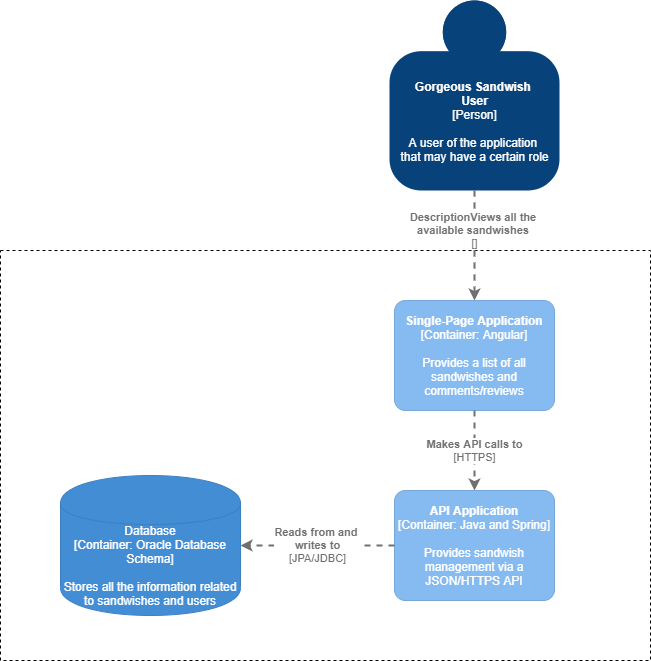

# 1ª Iteração

### Apesar desta iteração se focar mais nos CRN, decidimos ter uma iteração mais extensa podendo assim endereçar várias preocupações. As preocupações focadas foram as que bloqueavam avançar o projeto. Para além das preocupações, tivemos atenção às restrições apontadas, sendo realizada uma pequena pesquisa inicial de cada uma, para que quando fossem realizadas as respetivas implementações tivesse-mos uma ideia geral do que era necessário fazer.
### O grupo teve uma atenção especial em fazer uma analise detalhada aos drivers, podendo assim compreender os vários componentes, as restrições, as preocupações, os casos de uso e os atores.

### Etapa 2 - Escolha dos objetivos da iteração

- CRN 1 - Pesquisa sobre multilingua
- CRN 2 - Pesquisa de projetos com arquiteturas semelhantes
- CRN 3 - Pesquisa e documentação de JPA e JDBC
- CRN 4 - Possibilidade de várias pessoas trabalharem em similtânio
- CRN 5 - Modelo de domínio
- CON 1 - Utilização de JPA
- CON 3 - Prototipo acessivel através do FrontEnd
- CON 6 - Ferramentas Open Source e Spring
- CON 10 - RestFull Api
- CON 11 - Correr através da linha de comandos o FrontEnd
- CON 12 - Correr através da linha de comandos o BackEnd
- CON 15 - FrontEnd sendo uma SPA
- QA 3 - Configuração das classificações(reviews)
- QA 8 - Utilização de padrões de design

### Importância e custo para a implementação e para o negócio

- CRN 1 - Implementação (Médio) Negócio (Médio) 
- CRN 2 - Implementação (Médio) Negócio (Médio) 
- CRN 3 - Implementação (Médio) Negócio (Baixo) 
- CRN 4 - Implementação (Elevado) Negócio (Elevado) 
- CRN 5 - Implementação (Elevado) Negócio (Elevado) 
- CON 1 - Implementação (Elevado) Negócio (Médio) 
- CON 3 - Implementação (Elevado) Negócio (Elevado)  
- CON 6 - Implementação (Elevado) Negócio (Elevado) 
- CON 10 - Implementação (Elevado) Negócio (Elevado) 
- CON 11 - Implementação (Médio) Negócio (Médio) 
- CON 12 - Implementação (Médio) Negócio (Médio) 
- CON 15 - Implementação (Elevado) Negócio (Médio) 
- QA 3 - Implementação (Médio) Negócio (Elevado) 
- QA 8 - Implementação (Elevado) Negócio (Elevado) 

### Etapa 3 - Escolha do que melhorar

#### Nada a declarar nesta iteração

### Etapa 4 - Escolha de conceitos de design que satisfazem os drivers escolhidos

| Decisões de design e local de implementação                                           | Racional e                                                suposições                                                                                                                                                                                                                                                                                                                                                                      |
| -------------------------------------------------------------------- | --------------------------------------------------------------------------------------------------------------------------------------------------------------------------------------------------------------------------------------------------------------------------------------------------------------------------------------------------------------------------------------------------------------------------------------------- |                                       
|Desenvolver a aplicação de Cliente usando a arquitetura **Web Aplication** | Esta arquitetura é relacionada com o desenvolvimento da aplicação ser acessivel via browser (CON - 3).
|Desenvolver a aplicação de Servidor usando a arquitetura **MVC** |  O servidor permite ao browser realizar pedidos http, obtendo assim a informação necessária para enriquecer o site. Neste caso foi escolhida uma restFull Api(CON - 10).
|Desenvolver o sistema com Spring Boot Framework | O Spring boot foi selecionado devido à restrição descrita no enunciado.

### Etapa 5 - Escolha de elementos arquiteturais, alocar responsabilidades e definir interfaces

| Decisões de design e local de implementação                                           | Racional e                                                suposições                                                                                                                                                                                                                                                                                                                                                                      |
| -------------------------------------------------------------------- | --------------------------------------------------------------------------------------------------------------------------------------------------------------------------------------------------------------------------------------------------------------------------------------------------------------------------------------------------------------------------------------------------------------------------------------------- |                              
| Sistema de traduções simples | Dada a dimensão do projeto a utilização de Json com traduções basta armazenar as traduções num Json File, permitindo assim uma performance otima e sendo bastante configurável pois qualquer alteração necessária é algo simples de realizar.

### Etapa 6 - Diagramas e decisões

#### O diagrama seguinte define o modelo de domínio. Para tal despendemos grande parte da iteração para criar algo capaz de implementar todos casos de uso.

#### Apresentadas as responsabilidades de cada um dos componentes do sistema - Diagrama de nível 1 (System Context diagram)

#### No diagrama apresentado de seguida é possível observar de forma mais detalhada a arquitetura do sistema e como as responsabilidades são divididas - Diagrama de nível 2 (Container diagram)

#### O utilizador acede à aplicação pelo browser(Edge, Chrome, etc) onde lhe são apresentadas a sandes, os comentários e as avalições. O FrontEnd realiza pedidos Http/s ao Backend onde é garantido que a transição dos dados é correta. Para além disso realiza as validações e transformações entre o FrontEnd e a Base de Dados, estando a base de dados a persistir a informação. 

#### Atores

| Decisões de design e local de implementação                                           | Racional e                                                suposições                                                                                                                                                                                                                                                                                                                                                                      |
| -------------------------------------------------------------------- | --------------------------------------------------------------------------------------------------------------------------------------------------------------------------------------------------------------------------------------------------------------------------------------------------------------------------------------------------------------------------------------------------------------------------------------------- |                                        
| Administrador | Capaz de realizar todas as operações do sistema. 
| Cliente | Utilizador genérico, normalmente apenas tem acesso às funcionalidades "normais".
| Voluntário | Apenas realiza a funcionalidade de entrega de sandes para doar.

### Etapa 7 - Analise dos objetivos da iteração

## Quadro Kanban inicial

#### CRN-1 -> Relativamente à multilingua, tendo em conta que em principio será utilizado Angular para aceder ao protótipo através do FrontEnd, foram estudadas 3 opções:	
* Objeto JSON com as diferentes traduções para as linguagens desejadas.
* Utilização da API da google - Cloud Transition. (https://cloud.google.com/translate/docs)
* Internationalization (i18n), um mecanismo de adaptação de software a diferentes linguagens. (https://angular.io/guide/i18n)

#### CRN-2 -> Relativamente à pesquisa de projetos semelhantes concluimos que (https://www.guru99.com/dbms-architecture.html):
* Cada solução deve ser independente das outras, isto é, a alteração de uma não põem em causa a performace das outras.
* Uma solução em 3 camadas permite que cada uma tenha um proposito, potênciando melhores performances.
* Adotando soluções que ja existem no mercado facilita certas implementações, por exemplo a a configuração de utilização JPA/JDBC.
* Evitar que as diferentes camadas estejam muito agregadas, caso estejam dificultam alterações pois podem comprometer os outros sistemas.
* Concelho 1 - Estar preparado para alterações quer a nível de design ou implementação.
* Concelho 2 - Encontra-se disponível para implementar diferentes tipos de serviços.

#### CRN-3 -> Relativamente à possibilidade de ter acesso a base de dados, há necessidade de ter o JPA e JDBC configurados.
* A JPA é importante, porque é responsável pela definição de um meio de mapeamento objeto-relacional(ORM) para os objetos.
* A importância do JDBC é fazer a ligação com a base de dados onde envia instruções SQL.
* Uma das principais feramentas de ORM é o Hibernate, sendo atualmente acessível pela especificação do JPA.
* A complexidade de desenvolvimento em JDBC é superior ao JPA, logo o JPA simplifica a manutenção e modificabilidade do programa.

#### CRN-4 -> Relativamente à possibilidade de várias pessoas a trabalhar no mesmo projeto em simultâneo, é garantido através da utilização de Git.

#### CRN-5 -> Relativamente ao modelo de domínio foi necessário realizar uma análise detalhada e especifica. Dado o detalhe do relatório e modelos de domínio semelhantes concluimos que:
* É um dos artefactos mais importantes de design, caso não se crie um modelo de dominio capaz de ilustar os conceitos do problema, torna-se muito mais complexo realizar certas funcionalidades.
* Para o nosso caso é necessário ter um modelo escalável.
* Para alcançar mais detalhe, decidimos utilizar agregados, entidades, raizes e serviços.

Dada a complexidade e dimensão do projeto a desenvolver ( apenas duas linguagens necessárias e pouca informação a ser disponibilizada no FrontEnd ), optou-se por utilizar a primeira opção. 
A API da google seria ideal para permitir traduções para um número elevado de linguagens e, para além disso, a consistência entre as diferentes linguagens tornaria-se inconsistente. Relativamente ao i18n, também seria algo recomendado para um projeto que necessitasse de um número maior de linguagens.

#### QA 3 -> Relativamente à possibilidade ser possivel ter as classificações configuraveis.
* Utilizada uma ficheiro de configurações, ao iniciar as classificações, é obtido do ficheiro os valores parametrizados.

#### QA 8 -> Relativamente à utilização de padrões de design
* Foram estudados vários padrões a utilizar, desde a boas práticas de design às de codificações.
* •	Utilizado Single Responsability Principle.
* Criar o projeto com o padrão repository.

#### CON-15 -> Tendo em conta que o acesso pelo web browser deve ser feito através de uma SPA, foi decidido utilizar Angular devido à experiência da equipa de desenvolvimento em utilizar a framework. ( https://angular.io/ )

## Quadro Kanban final
