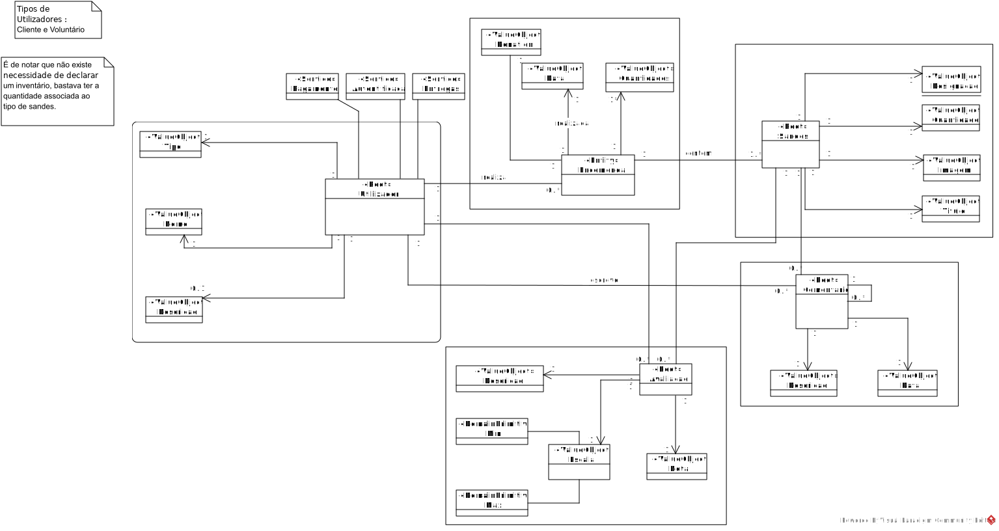

# 2ª Iteração

### A escolha dos objetivos desta iteração baseiam-se no início da implementação dos casos de uso, criando um suporte primário capaz de realizar os casos de uso mais relevantes. Após a sua implementação é mais fácil detalhar as suas regras de negócio. 
### Os CRN em falta também foram considerados nesta iteração e os drivers que não foram completados na iteração anterior.

## Etapa 2 - Escolha dos objetivos da iteração

- UC 1 - Criar sande
- UC 2 - Eliminar sande
- UC 3 - Alterar sande
- UC 4 - Criar comentário
- UC 5 - Eliminar comentário 
- UC 6 - Criar avaliação
- UC 7 - Eliminar avaliação 
- UC 9 - Criar Encomenda
- UC 10 - Alterar Encomenda
- CRN 6 - Autenticação
- CRN 7 - Autorização
- CON 2 - Utilização de JDBC
- CON 4 - Encomenda da sande entre 3 a 28 dias
- CON 5 - Alteração da encomenda até 5 dias
- CON 9 - Implementação de multilíngua
- CON 13 - Sistema compatível com sistema de entregas e pagamentos
- QA 3 - Configuração de classificações
- QA 6 - Utilização de DTO's
- QA 7 - Utilização do padrão Builder
- QA 8 - Utilização de padrões de design

### Importância e custo para a implementação e para o negócio

- UC 1 - Implementação (Médio) Negócio (Elevado) 
- UC 2 - Implementação (Médio) Negócio (Médio) 
- UC 3 - Implementação (Médio) Negócio (Elevado) 
- UC 4 - Implementação (Médio) Negócio (Elevado) 
- UC 5 - Implementação (Médio) Negócio (Médio) 
- UC 6 - Implementação (Médio) Negócio (Elevado) 
- UC 7 - Implementação (Médio) Negócio (Médio) 
- UC 9 - Implementação (Elevado) Negócio (Elevado) 
- UC 10 - Implementação (Elevado) Negócio (Elevado)
- CRN 6 - Implementação (Baixo) Negócio (Elevado) 
- CRN 7 - Implementação (Baixo) Negócio (Elevado) 
- CON 2 - Implementação (Elevado) Negócio (Elevado) 
- CON 4 - Implementação (Médio) Negócio (Elevado) 
- CON 5 - Implementação (Médio) Negócio (Médio) 
- CON 9 - Implementação (Médio) Negócio (Elevado) 
- CON 13 - Implementação (Médio) Negócio (Médio) 
- QA 3 - Implementação (Médio) Negócio (Elevado) 
- QA 6 - Implementação (Médio) Negócio (Médio) 
- QA 7 - Implementação (Médio) Negócio (Baixo) 
- QA 8 - Implementação (Médio) Negócio (Alto) 

## Etapa 3 - Escolha do que melhorar

#### O que foi decidido para melhorar foram os módulos da iteração anterior em atraso e o módulo de domínio.

## Etapa 4 - Escolha de conceitos de design que satisfazem os drivers escolhidos

| Decisões de design e local de implementação                                           | Racionais e                                                suposições                                                                                                                                                                                                                                                                                                                                                                      |
| -------------------------------------------------------------------- | --------------------------------------------------------------------------------------------------------------------------------------------------------------------------------------------------------------------------------------------------------------------------------------------------------------------------------------------------------------------------------------------------------------------------------------------- |                                
|Criar um domínio para a aplicação | Antes de se começar a implementar os casos de uso é necessário criar um modelo capaz de satisfazer as necessidades do negócio. Para tal são criadas a entidades e as suas relações. 
|Identificar os objetos capazes de mapear as funcionalidades | Tendo cada objeto um propósito específico, este é responsável por determinadas funcionalidades, sendo assim promovidas responsabilidades únicas.
|Uso de JPA | Permite a utilização de ORM's para mapeamento de objetos, é bastante usada em paralelo com spring. Outras ferramentas não foram consideradas pelo facto de esta ser usada.

## Etapa 5 - Escolha de elementos arquiteturais, alocar responsabilidades e definir interfaces

| Decisões de design e local de implementação                                           | Racional e                                                suposições                                                                                                                                                                                                                                                                                                                                                                      |
| -------------------------------------------------------------------- | --------------------------------------------------------------------------------------------------------------------------------------------------------------------------------------------------------------------------------------------------------------------------------------------------------------------------------------------------------------------------------------------------------------------------------------------- |                                 
|Conexão entre módulos com apoio de Spring | A gestão das dependências foi facilitada com apoio da Spring, por exemplo a injeção de componentes é facilitada com o "Autowired".
|Mapeamento dos objetos | A anotação permite mapear os objetos com grande flexibilidade e sem grande esforço.
|Refatoração do modelo de domínio | Com a implementação dos casos de uso foi percetivel que era necessário realizar certos ajuste.
|Criar um sistema aberto a alterações | É percetivel que uma aplicação deste tipo tem de estar disponível a expansão, sendo possível adicionar funcionalidades externas sem comprometer a sua estabilidade (CON 13). 
|Regras de negócio configuráveis | A implementação de regras de negócio como validações (CON 4, CON 5) estão abertas a qualquer mudança onde o funcionamento da aplicação não é comprometido.

## Etapa 6 - Diagramas e decisões

| Decisões de design e local de implementação                                           | Racional e                                                suposições                                                                                                                                                                                                                                                                                                                                                                      |
| -------------------------------------------------------------------- | --------------------------------------------------------------------------------------------------------------------------------------------------------------------------------------------------------------------------------------------------------------------------------------------------------------------------------------------------------------------------------------------------------------------------------------------- |                                       
| Ator | Responsável por realizar ações sobre os sistemas.
| Presentation | Este modulo contêm modulos que controlam a interação do utilizador e o seu fluxo.
| Controller | Esta camada é responsável por controlar o fluxo de informação entre back e front end.
| Service (Lógica de negócio) | Contêm as operações que mantêm a lógica de negócio.
| Database | Persistência de dados.
| Model | Modela os os domínios existentes no negócio.
| Utils | Utilizado entre vários módulos, permite os métodos chamarem outros métodos de forma a reduzir linhas de código e facilitar a codificação.
| DTO | Este modulo garante que informação confidencial não é extraída de certos módulos, garantido segurança dos dados.

### O diagrama seguinte define o modelo de domínio, este foi refatoração nesta iteração.

### Representação das responsabilidades entre Casos de Uso.

### Apresentadas as responsabilidades de cada um dos componentes da solução

* Detalha as responsabilidades de cada um dos componentes.

* Detalha as responsabilidades de cada um dos componentes, entrando em detalhe na camada de persistência.

---------

#### O diagrama de sequência apresentado é genérico, demonstrando o fluxo da informação de forma a entender o que realiza em cada um dos módulos. Foram criados mais diagramas, mas não sendo necessário entrar em detalho decidimos não os colocar no relatório.

* O Cliente realiza o pedido, o sistema recebe a informação do pedido, trata-a e devolve-a. 

* O Cliente acede ao serviço pelo browser, pela SPA, esta realiza a comunicação com o backend, enviando um pedido, o backend recebe o pedido, processa a informação, devolvendo ao cliente.

#### Explicação detalhado do fluxo
* O utilizador introduz o link para a GorgeousSandwich, tendo lá um site que permite mudar a linguagem de apresentação e onde são apresentadas sandes com os seus comentários e avaliações. Estas informações vêm do backend.
* O Controller recebe o pedido das informações necessárias, conforme a parametrização dos dados é interpretada qual deve a informação a obter.
* O Serice restrutura a informação e realiza o pedido ao repositório, cria ou decompõe os objetos e obtém propriedades fulcrais para configurar o sistema.
* O Dto garante que no fluxo de informação são entrem nem sai informação confidencial.
* O Model cria o objeto capaz de realizar as funcionalidades de negócio.
* O Repositório garante que os dados guardados estão corretos, permitindo realizar pesquisas a estes mesmos.

-----

#### Para além dos diagramas genéricos o grupo decidiu realizar um diagrama de **Crud**.

-----

### **Divisão de responsabilidades**
#### De forma a entender melhor os métodos criados e as responsabilidades associadas, são de seguida explicados os mesmos visto que o desenho da solução nesta iteração envolveu a sua implementação. Neste caso, visto que foi realizado um CRUD básico para todos os modelos existente, serão inicialmente explicados de um modo geral os métodos associados e depois será feita uma análise de casos mais específicos relacionados com alguns dos modelos tendo em conta as restrições, preocupações e atributos de qualidade.

### **Repository:**

| Método                                          | Descrição                                                                                                                                                                                                                                                                                                                                                                      |
| -------------------------------------------------------------------- | --------------------------------------------------------------------------------------------------------------------------------------------------------------------------------------------------------------------------------------------------------------------------------------------------------------------------------------------------------------------------------------------------------------------------------------------- |                                       
| save(Model model) | Responsável por persistir uma nova entidade na base de dados.
| findAll() | Responsável por retornar a lista de todas as entidades existentes na base de dados.
| findById(long id) | Responsável por retornar uma entidade com um determinado id da base de dados.
| delete(Model model) | Responsável por apagar uma determinada entidade da base de dados através do id.

### **Service:**

Esta componente encontra-se diretamente ligada à falada anteriormente através dos métodos referidos, sobre a qual processa todas as validações necessárias.

| Método                                          | Descrição                                                                                                                                                                                                                                                                                                                                                                      |
| -------------------------------------------------------------------- | --------------------------------------------------------------------------------------------------------------------------------------------------------------------------------------------------------------------------------------------------------------------------------------------------------------------------------------------------------------------------------------------------------------------------------------------- |                                       
| createModel(ModelDTO modelDTO) | Responsável por validar o objeto e a persistir o mesmo caso passe nas validações.
| updateModel(long id, ModelDTO modelDTO) | Responsável por validar os dados a alterar e através do id persistir os novos campos dessa entidade.
| getAllModels() | Responsável por retornar todas as entidades no formato desejado (DTO).
| getModelById(long id) | Responsável por retornar uma determinada entidade através do id no formato desejado (DTO).
| deleteModel(long id) | Responsável por apagar uma determinada entidade através do id.

É também importante referir a existência de método diferente no modelo das **Sandes**:

| Método                                           | Descrição                                                                                                                                                                                                                                                                                                                                                                      |
| -------------------------------------------------------------------- | --------------------------------------------------------------------------------------------------------------------------------------------------------------------------------------------------------------------------------------------------------------------------------------------------------------------------------------------------------------------------------------------------------------------------------------------- | 
| getAllSandesDetailed() | Responsável por retornar todas as sandes existentes no sistema e os comentário e avaliações associados às mesmas.

### **Controller:**

Esta componente encontra-se ligada à anterior e é responsável por decidir como o utilizador interage com a aplicação.

| Método                                          | Descrição                                                                                                                                                                                                                                                                                                                                                                      |
| -------------------------------------------------------------------- | --------------------------------------------------------------------------------------------------------------------------------------------------------------------------------------------------------------------------------------------------------------------------------------------------------------------------------------------------------------------------------------------------------------------------------------------- |                                       
| createModel(ModelDTO modelDTO) | Responsável por criar um novo modelo através dos dados inseridos pelo utilizador.
| updateModel(long id, ModelDTO modelDTO) | Responsável por alterar um modelo tendo em conta os dados inseridos pelo utilizador.
| getAllModels() | Responsável por listar todos os modelos e retorná-los para a rota associada.
| getModelById(long id) | Responsável por apresentar ao utilizador um modelo específico através do seu id.
| deleteModel(long id) | Responsável por apagar um modelo a partir do seu id.

Assim como nos serviços, o controller das **Sandes** também contém o método mais importante de toda a aplicação. Este será o endpoint que irá fazer comunicação com o fronted:

| Método                                          | Descrição                                                                                                                                                                                                                                                                                                                                                                      |
| -------------------------------------------------------------------- | --------------------------------------------------------------------------------------------------------------------------------------------------------------------------------------------------------------------------------------------------------------------------------------------------------------------------------------------------------------------------------------------------------------------------------------------- |                                       
| getAllSandesDetailed() | Responsável por listar ao utilizador todas as sandes existentes no sistema e os comentários e avaliações associados às mesmas.

### **Utils:**

Nesta componente encontram-se implementados todos os métodos adicionais, responsáveis pela lógica do projeto, os quais são utilizados por todas as outras componentes.

| Método                                          | Descrição                                                                                                                                                                                                                                                                                                                                                                      |
| -------------------------------------------------------------------- | --------------------------------------------------------------------------------------------------------------------------------------------------------------------------------------------------------------------------------------------------------------------------------------------------------------------------------------------------------------------------------------------------------------------------------------------- |                                       
| isBetweenDates(Date date) | Responsável por verificar se uma dada data se encontra entre um determinado período de tempo, definido por um ficheiro de configuração.
| getDateFromDaysApart(int daysApart) | Responsável por retornar a data atual mais os dias inseridos na variável "daysApart".
| isHourBetweenInterval(String horaRequisitada) | Responsável por verificar se um hora se encontra entre duas horas predefinidas por um ficheiro de configuração.
| map(Model model, ModelDTO dto) | Responsável por retornar o DTO respetivo de uma dado modelo.
| mapAll(ModelList modelList, DTOList dtoList) | Responsável por retornar uma lista de DTOs respetiva de um dada lista de modelos.
| getPropertiesValue(String key) | Responsável por retornar uma determinada propriedade tendo em conta a chave passado por parâmetro.

### Etapa 7 - Analise dos objetivos da iteração

## Quadro Kanban inicial

### CRN-6 -> Relativamente à autenticação, tendo em conta a necessidade de análise mas não de implementação:	
* O frontEnd deve estar disponível à eventualidade de ser necessário realizar "login".
* O backend deve ser capaz de processar a autenticação, garantindo que os utilizadores apenas realizam funções que têm permissões.
* Deve ser possível alterar o modulo do utilizador de forma a garantir os pontos acima descritos.

### CRN 7 - Relativamente à autorização, apenas é necessário espelhar:
* Os utilizadores apenas têm acesso ao que é permitido.
* Ao criar um utilizador, caso não seja indicado, é lhes atribuído o minímo de permissões.

### CON 4 - Relativamente à restrição da encomenda da sandes ser entre 3 a 28 dias:
* Ao criar a encomenda é validada se a data da encomenda se encontra dentro da gama de dias definidos.

### CON 5 - Relativamente à restrição de alteração da encomenda até 5 dias:
* Ao alterar a encomenda é validade se a data entrega da encomenda é superior ou igual a 5 dias.

### QA 6 - Utilização de DTO's
* Criar DTO's para a transferência de dados entre camadas, assim garantindo a confidencialidade dos dados.

### QA 7 - Utilização do padrão Builder
* Foi criado para cada classe model um builder para ajudar na construção segura dos objetos favorecendo a integridade dos dados.

## Quadro Kanban final

