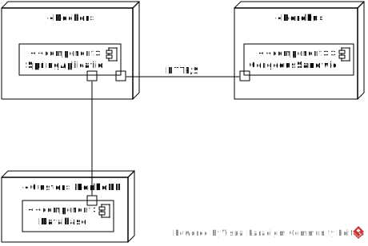
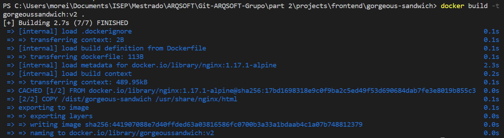
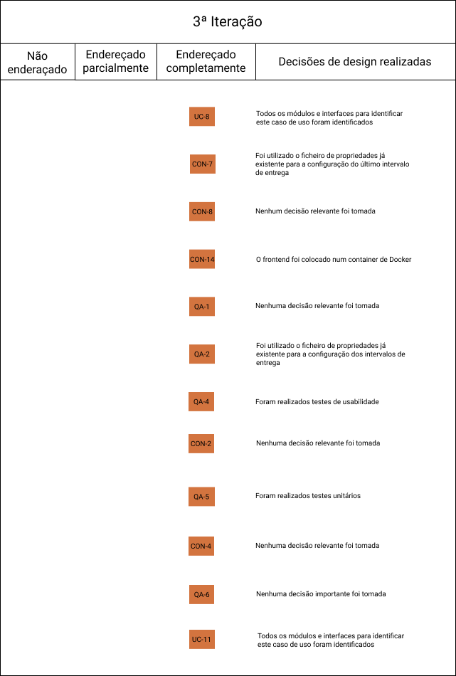

# 3ª Iteração

### A escolha dos objetivos da iteração consiste em verificar o que falta e o que melhorar e desenvolver.

### Etapa 2 - Escolha dos objetivos da iteração

- UC 8 - Registo de levantamento de Sandes para doação
- UC 11 - Visualizar dados
- CON 7 - Configuração do ultimo intervalo de entrega
- CON 8 - Escrita da avaliação da sande restrita a quem experimentou 
- CON 14 - Implementação em Docker
- QA 1 - Configuração de usar JPA/JDBC
- QA 2 - Configuração de intervalos de entrega e horas de entrega 
- QA 4 - Testar FrontEnd
- QA 5 - Testar BackEnd e serviços

### Importância e custo para a implementação e para o negócio

- UC 8 - Implementação (Médio) Negócio (Elevado) 
- UC 11 - Implementação (Elevado) Negócio (Elevado) 
- CON 7 - Implementação (Elevado) Negócio (Elevado) 
- CON 8 - Implementação (Elevado) Negócio (Elevado) 
- CON 14 - Implementação (Elevado) Negócio (Elevado) 
- QA 1 - Implementação (Elevado) Negócio (Médio) 
- QA 2 - Implementação (Elevado) Negócio (Médio) 
- QA 4 - Implementação (Baixo) Negócio (Elevado) 
- QA 5 - Implementação (Baixo) Negócio (Elevado) 

### Etapa 3 - Escolha do que melhorar

#### O que foi decidido para melhorar foi módulos da iteração anterior em atraso e o modulo de domínio.

### Etapa 4 - Escolha de conceitos de design que satisfazem os drivers escolhidos

| Decisões de design e local de implementação                                           | Racionais e                                                suposições                                                                                                                                                                                                                                                                                                                                                                      |
| -------------------------------------------------------------------- | --------------------------------------------------------------------------------------------------------------------------------------------------------------------------------------------------------------------------------------------------------------------------------------------------------------------------------------------------------------------------------------------------------------------------------------------- |                                          
|Usar docker | Docker é uma plataforma que permite a virtualização da entrega de software(CON 14), criando contentores. Contentores estão isolados entre si. Docker é gratuito e dispõe de diversas funcionalidades adicionais.
|Testes FrontEnd | Permite verificar o comportamento dos vários componentes do GorgeousSandwich (QA -4). Neste caso o grupo decidiu adotar teste de comportamento, verificando visualmente se a funcionamento da aplicação estava correto.
|Testes BackEnd | Permite validar diversos comportamentos da RestFull Api (QA - 5), foram usados diversos testes neste caso. Testes unitários aos modelos, testes de comportamento e testes onde validamos se o fluxo da informação é correto (ex: Ao criar, obter, alterar, obter e eliminar, seguindo esta ordem garantimos a atomicidade da informação e que os métodos garantem segurança nos dados).

### Etapa 5 - Escolha de elementos arquiteturais, alocar responsabilidades e definir interfaces

| Decisões de design e local de implementação                                           | Racionais e                                                suposições                                                                                                                                                                                                                                                                                                                                                                      |
| -------------------------------------------------------------------- | --------------------------------------------------------------------------------------------------------------------------------------------------------------------------------------------------------------------------------------------------------------------------------------------------------------------------------------------------------------------------------------------------------------------------------------------- |                                 
|Conexão entre módulos com apoio de Spring | A gestão das dependências foi facilitada com apoio do Spring, por exemplo, a injeção de componentes é facilitada com o "Autowired".
|Mapeamento dos objetos | A anotação permite mapear os objetos com grande flexibilidade e sem grande esforço.
|Refatorização do modelo de domínio | Com a implementação dos casos de uso foi percetível que era necessário realizar certos ajustes.
|Criar um sistema aberto as alterações | É percetível que uma aplicação deste tipo tem de estar disponível a expansão, sendo possível adicionar funcionalidades externas sem comprometer a sua estabilidade(CON 13). 
|Regras de negócio configuráveis | A implementação de regras de negócio como validações (CON 4,CON 5) estão abertas a mudança onde qualquer não compromete o funcionamento da aplicação.

### Etapa 6 - Diagramas e decições

### O diagrama seguinte consiste num diagrama de **Deployment**.
* Este diagrama consiste no diagrama implementado.
* Por questões de ser mais simples, melhorar a performance e cumprir os requisitos, o backend e a base de dados encontram-se na máquina e o frontend corre num contentor Docker.

* Esta alternativa demonstra a capacidade de colocar cada sistema como independente, o frontend em cloud no **Heroku** continuando a comunicar com o backend através de pedidos (HTTP/S), o backend no Docker e a base de dados 
num **Cluster** de MongoDb.

### Etapa 7 - Analise dos objetivos da iteração

### ATAM
Para a avaliação do ATAM em relação ao risco, foi levado em consideração o impacto que um determinado atributo de qualidade teria no sistema caso o mesmo estiver indisponível. Na classificação o 3, 6 e o 9 significam baixo, médio e alto respetivamente. Foi identificado o tipo do atributo e a razão pela qual existem.

|Cenário QA-1|Protótipo compatível com JPA e JDBC|
|:---:|:---:|
|  Atributo |  Modificabilidade e portabilidade|
|  Razão | Poder modelar os dados e aceder a Base de dados |
|  Risco | 9 |

|Cenário QA-2|Configuração de intervalos de entrega e horas de entrega|
|:---:|:---:|
|  Atributo |  Modificabilidade|
|  Razão | Capacidade de alterar os intervalos de entrega e horas
 de entrega através de um ficheiro de configuração|
|  Risco | 1|

|Cenário QA-3|Configuração dos intervalos das classificações das sanduíches|
|:---:|:---:|
|  Atributo |  Modificabilidade|
|  Razão | Capacidade de alterar os limites das classificações
 através de um ficheiro de configuração |
|  Risco | 3 |

|Cenário QA-4|Testar FrontEnd|
|:---:|:---:|
|  Atributo |  Testabilidade|
|  Razão | Garantir que os dados apresentados estão corretos |
|  Risco | 8 |

|Cenário QA-5|Testar BackEnd e serviços|
|:---:|:---:|
|  Atributo | Testabilidade|
|  Razão | Garantir que as funcionalidades funcionam corretamente |
|  Risco | 8 |

|Cenário QA-6|Utilização de DTO's|
|:---:|:---:|
|  Atributo |  Confidencialidade e integridade|
|  Razão | Não são disponibilizados dados que podem comprometer a
 segurança dos dados, como por exemplo, o id dos objetos |
|  Risco | 6 |

|Cenário QA-7|Utilização do padrão Builder|
|:---:|:---:|
|  Atributo |  Integridade|
|  Razão | Garantir que todos os dados criados estão certos |
|  Risco | 6 |

|Cenário QA-8|Utilização de padrões de design|
|:---:|:---:|
|  Atributo |  Restrição de Implementação|
|  Razão | Obedecer uma estrutura de desenvolvimento do código |
|  Risco | 5 |

## Quadro Kanban inicial

#### CON - 7  -> Registo de levantamento de Sandes para doação:
* Só é permitido o levantamento de uma sande para a doação quando o utilizador é um voluntário.

#### CON -8  -> Escrita da avaliação da sande restrita a quem experimentou:
* Criada uma restrição nos serviços que permite que apenas quem encomendou uma sande pode fazer uma avalição do mesmo.

#### CON -14  -> Relativamente à implementação em Docker:
* Foi detetado que devia ser implementado em Docker.
* Por questões de performance e prova de conceito, decidimos implementar apenas uma das aplicações, demonstrando assim que é possível comunicação entre as aplicações, mesmo que estas estejam em contentores diferentes.
* Para implementar aplicações no Docker, é necessário compilar. Caso deseje criar imagens de aplicações java é necessário fazer **Build** criando um **Jar**, caso seja o frontEnd é criado **Package Dist** que contêm os ficheiros compilados.

* É criado de seguida uma imagem que contêm a aplicação, o detalhe da criação da imagem depende do **DockerFile**.

* #### QA 1  -> Configuração de usar JPA/JDBC:
* Usou o JPA para poder modelar os dados colocando as anotações nas classes model.
* O JDBC foi usado para fazer a ligação com a Base de dados.

* #### QA 2  -> Configuração de intervalos de entrega e horas de entrega:
* Capacidade de alterar os intervalos de entrega e horas de entrega através de um ficheiro de configuração.

* #### QA 4  -> Testar FrontEnd:
* Foram feitos testes de usabilidades para garantir que as funcionalidades estão certos.

* #### QA 5  -> Testar BackEnd e serviços:
* Foram feitos testes unitários para garantir a consistência dos dados.

## Quadro Kanban final
