# 1ª Iteração

### Esta iteração terá como principal objetivo a organização da equipa no processo de reconstrução do monolítico anteriormente criado em vários microsserviços.
### Posto isto, este terá como seu ponto de partida um projeto já implementado, tratando-se este de um *Brownfield*
### O grupo teve uma atenção especial em fazer uma análise detalhada aos drivers, podendo assim compreender as várias componentes, as restrições, as preocupações, os casos de uso e os atores.

## Roadmap 

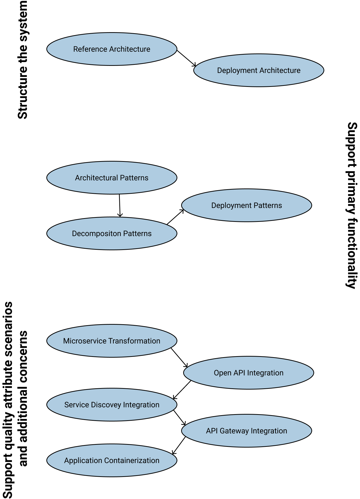

### Etapa 1

#### Importância e custo para a implementação e para o negócio

|   ID	|   Importância para o cliente	|   Dificuldade de implementação	|
|:---:	        |:---:	                        |:---:	    |
|   CRN-1	    |   Média                    	|   Média	    |
|   CRN-2	    |   Média	                    |   Fácil	|
|   CRN-3	    |   Média	                    |   Fácil	|
|   CRN-4	    |   Média                        |   Média	|
|   CRN-5	    |   Média                        |   Elevada	|
|   CON-1	    |   Média                        |   Média	|
|   CON-2	    |   Elevada                        |   Elevada	|
|   CON-3	    |   Elevada                        |   Elevada	|
|   CON-4	    |   Elevada                        |   Média	|
|   CON-5	    |   Elevada                        |   Média	|
|   QA-1	    |   Elevada                        |   Elevada	|

### Etapa 2 - Escolha dos objetivos da iteração

Esta é a primeira e única iteração porque o objetivo é modificar o design existente para oferecer suporte a todos os novos *drivers*.
Para suportar a nova arquitetura (QA-1), a equipa deve ter em mente todos os drivers que podem ter influência no desenvolvimento. Apenas um número limitado de drivers precisa ser analisado, neste caso, os drivers novos. Selecionou-se os seguintes:

- CRN 1 - Refatorização de determinados componentes anteriormente implementados.
- CRN 2 - Estudo sobre a utilização de uma API Gateway.
- CRN 3 - Processo de migração deve evidenciar o padrão *Strangler Pattern*.
- CRN 4 - Estudo da utilização do service discovery.
- CRN 5 - Estudo dos métodos de decomposição em microsserviços.
- CON 1 - Chamadas de métodos locais devem ser substituídas por chamadas remotas síncronas ou melhores opções.
- CON 2 - Dependências diretas na base de dados devem ser eliminadas, dependendo das estratégias de gerenciamento de dados adotadas.
- CON 3 - Arquitetura de microserviço precisa de uma base de dados por microserviço.
- CON 4 - A especificação OpenAPI (Swagger) deve ser usada.
- CON 5 - O desenvolvimento da solução deverá ser realizada em microsserviços.
- QA 1 - Deploy das soluções para *containers*.

### Etapa 3 - Escolha do que melhorar

##### Nesta iteração deverão ser revistos alguns detalhes relativos à solução desenvolvida anteriormente. (CRN-1)
##### Todo o sistema deve ser redefinido. O monolítico existente deve ser decomposto numa arquitetura de microsserviços para suportar os *drivers* atuais.

### Etapa 4 - Escolha de conceitos de design que satisfazem os drivers escolhidos

| Decisões de design e local de implementação                                           | Racional e                                                suposições                                                        Elevada                                                                                                                                                                                                                                                                                                              |
| -------------------------------------------------------------------- | --------------------------------------------------------------------------------------------------------------------------------------------------------------------------------------------------------------------------------------------------------------------------------------------------------------------------------------------------------------------------------------------------------------------------------------------- |                                       
|Desenvolver a aplicação de Cliente usando a arquitetura **Web Aplication** | Esta arquitetura é relacionada com o desenvolvimento da aplicação ser acessivel via browser.
|Desenvolver a aplicação de Servidor usando a arquitetura **MVC** |  O servidor permite ao browser realizar pedidos http, obtendo assim a informação necessária para enriquecer o site. Neste caso foi escolhida uma restFull Api.
|Linguagens a utilizar | Para o desenvolvimento em microsserviços a equipa decidiu manter a linguagem previamente utilizada no monolitico de forma a facilitar a decomposição do mesmo.
|Utilizar uma estrutua lógica para os microsserviços | Esta arquitetura oferece suporte ao desenvolvimento de microsserviços ao fornecer uma interface consumida exclusivamente por outro serviço ( neste caso, o front-end ). Posto isto a camada de apresentação é substituida por uma camada de serviço que contém os componentes responsáveis por export dos serviços e trocar informações.
|Service discovery | Para realizar a discoberta de serviços o grupo realizou uma pesquisa *extende* de forma a compreender o seu propósito e como utilizar. Consiste numa abstração dos serviços utilizados, permite facilitar a análise e decomposição dos serviços.  

### Etapa 5 - Escolha de elementos arquiteturais, alocar responsabilidades e definir interfaces

##### Tendo em conta a decomposição do monolítico desenvolvido anteriormente numa arquitetura de microserviços, primeiramente foi necessário definir a divisão de tarefas e responsabilidades a conferir a cada um dos mesmos. Posto isto, foi utilizada a terminologia de *bounded context*, que auxilia nesta separação de responsabilidades e na divisão do domínio em vários sub-domínios. 

#### Na tabela seguinte é apresentada a divisão proposta, onde cada um dos *bounded contexts* criados representam um microsserviço.

| Decisões de design e local de implementação                                           | Racional e                                                suposições                                                                                                                                                                                                                                                                                                                                                                      |
| -------------------------------------------------------------------- | --------------------------------------------------------------------------------------------------------------------------------------------------------------------------------------------------------------------------------------------------------------------------------------------------------------------------------------------------------------------------------------------------------------------------------------------- |                              
| Contexto de Utilizador  | Responsável pela gestão dos utilizadores da aplicação.
| Contexto de Sandes | Responsável pela gestão das sandes e dos comentários/avaliações respetivos.
| Contexto de Encomenda  | Responsável pela gestão das encomendas da aplicação.

### Etapa 6 - Diagramas e decisões

#### O modelo de domínio sofreu ligeiras alterações de forma a ser possível implementar os requisitos corretamente.

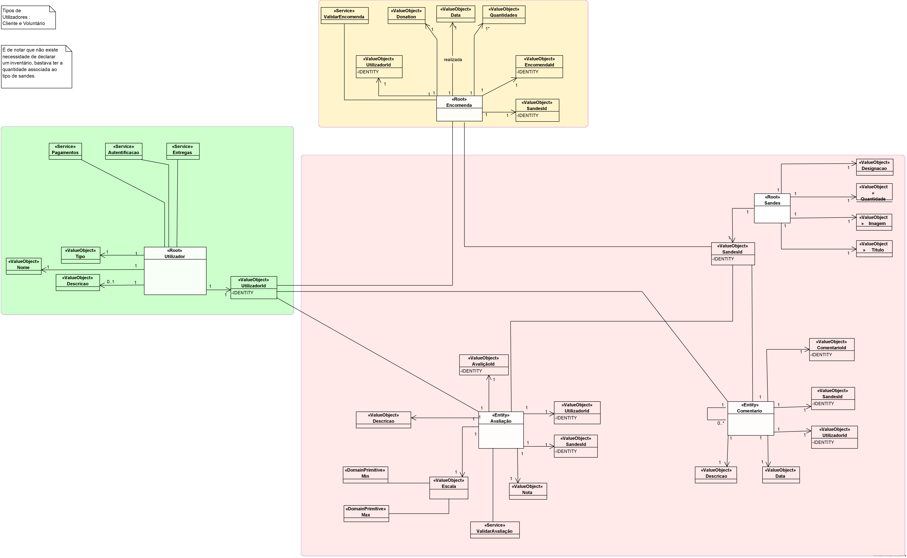

* Demonstração de serviços internos e externos de forma a dar a entender onde estes se aplicam.
* Divisão em contextos.
* **Value Objects** partilhados, isto é, um value object existe no seu domínio e uma cópia existe onde for necessário, como por exemplo um Id de uma *Entity* pode ter uma ligação com outra *Entity* de outro contexto.

### Diagrama de Componentes

#### Tendo em conta os *inputs* recebidos, este diagrama representa as interações entre cada uma das componentes existentes.

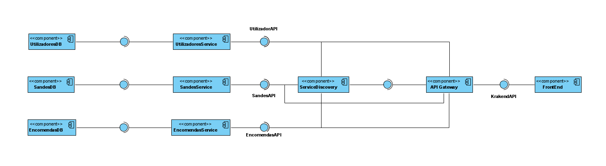

#### Assim como referido na etapa 5, o monolítico desenvolvido anteriormente foi dividido em 3 diferentes *bounded contexts*. De seguida são apresentados os diagramas que representam esses mesmos contextos.

#### **Contexto de Utilizador**

#### Responsável pela gestão dos utilizadores da aplicação

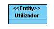

* **Utilizador** -> Entidade que representa um utilizador da aplicação.

#### **Contexto de Sandes**

#### Responsável pela gestão das sandes e dos comentários/avaliações respetivos

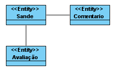

* **Sande** -> Entidade que representa um utilizador da aplicação.
* **Comentário** -> Entidade que representa um comentário a uma sande da aplicação.
* **Avaliação** -> Entidade que representa uma avaliação de uma sande da aplicação.

#### **Contexto de Encomenda**

#### Responsável pela gestão das encomendas da aplicação

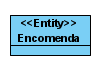

* **Encomenda** -> Entidade que representa uma encomenda da aplicação.

### Responsabilidades

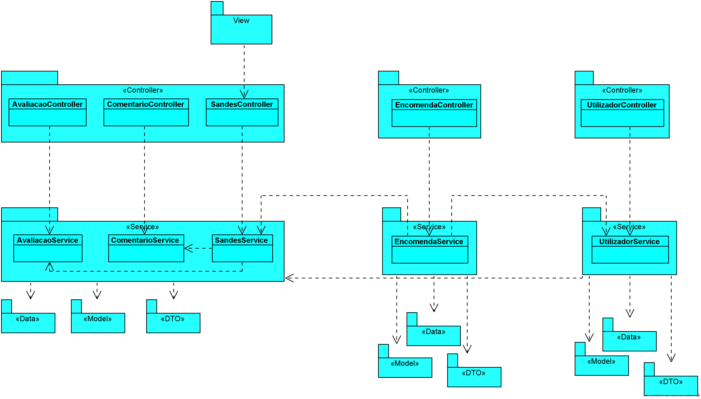

* As responsabilidades do sistema são essenciais para construir aplicações.
* O frontend realiza um pedido a um controller especifico, que retorna dados capazes de alimentar a UI.
* Os controllers realizam pedidos aos serviços.
* Os serviços devem ser capazes de manter, modelar e transformar informações.
* O serviço da encomenda realiza pedidos ao serviços externos, de forma a compor a encomenda com as sandes e com os utilizadores.

### Deploy

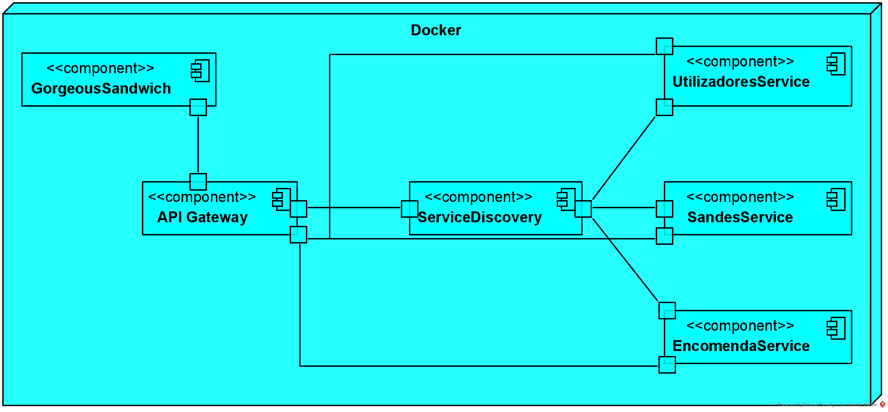

* Todas as aplicações encontram-se no docker, sendo que o funcionamento é bastante similar ao funcionamento nas máquinas locais, apenas diferem os pedidos realizados devido ao kernel interno do docker.

### Context Map

* Context Mapper é uma estrutura de modelagem e extensível para DDD, e é uma forma detalhada de expressar integrações.
* Os relacionamentos entre contextos limitados podem ser definidos em termos de direção;(upstream e downstream). O downstream do relacionamento depende dos dados ou do comportamento do upstream, mesmo em fatores menos técnicos. A extremidade upstream influenciará o contexto downstream.
	
A seguir se encontra o código desenvolvido num ficheiro .cml para a criação do contextMap:


        ContextMap DDDSampleMap {
            contains Utilizador
            contains Sandes
            contains Encomenda

            Utilizador -> Encomenda

            Sandes -> Encomenda

        }

        BoundedContext Utilizador
        BoundedContext Sandes
        BoundedContext Encomenda

Para gerar a imagem a seguir, foi necessário a instalação do "Graphviz" no computador, e uma extensão no IDE, caso do VSCode é o "Context Mapper".
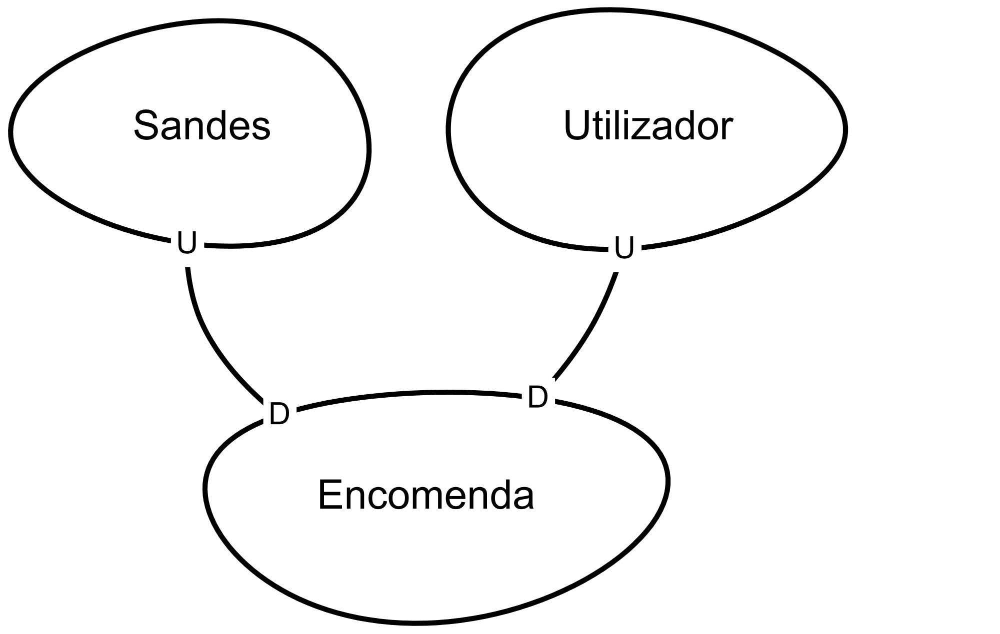


### Etapa 7 - Análise dos objetivos da iteração

### ATAM
Para a avaliação do ATAM em relação ao risco, foi levado em consideração o impacto que um determinado atributo de qualidade(QA) teria no sistema caso o mesmo estiver indisponível. Na classificação o 3, 6 e o 9 significam baixo, médio e alto respetivamente. Foi identificado apenas um QA onde é apresentado o tipo do atributo e a razão pela qual o mesmo existe.

|Cenário QA-1|Deploy das soluções para containers|
|:---:|:---:|
|  Atributo |  Suportabilidade|
|  Razão | Poder ter as soluções(microsserviços, frontend, service discovery e API Gateway) no docker |
|  Risco | 8 |


### Quadro Kanban inicial
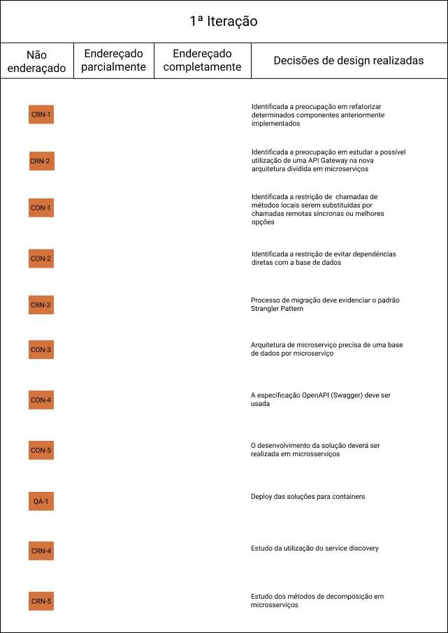

#### CRN-1 -> Refatorização das componentes anteriormente implementadas. Tendo em conta a avaliação relativa ao projeto anterior, foram analisadas algumas melhorias a fazer.
* Implementação dos Value Objects em todos os microsserviços relativos à entidade respetiva.
* Comunicação entre os serviços de cada entidade é agora realizada entre os diferentes microsserviços, portanto foi necessário implementar uma nova solução.

#### CRN-2 -> Estudo sobre a utilização de uma API Gateway. Tendo em conta que o sistema será dividido em vários microsserviços sentiu-se a necessidade de estudar a possibilidade de ser utilizada uma API Gateway de forma a permitir o acesso a todos os microsserviços a partir de um único serviço.
* KrakenD é uma API Gateway de alto desempenho que permite "juntar" todos os microsserviços com bastante facilidade. Este foi um serviço estudado e considerado pela equipa para este *concern* por permitir o redirecionamento de todos os pedidos desejados para um só *endpoint* de uma forma muito simples, através de um único ficheiro JSON.

De seguida é apresentado o ficheiro krakend construído que suporta alguns dos endpoints disponibilizados pelos vários microsserviços.

- [Ficheiro JSON krakend](https://bitbucket.org/mei-isep/arqsoft-20-21-team-atb-400/src/master/part%203/projects/backend/api_gateway/krakend.json)

Desconstruindo um pouco este ficheiro, este é composto pelas seguintes configurações mais importantes:

- Porta em que a API Gateway está a correr (port)
- Versão do krakend (version)
- Tipo do output produzido pelo serviço (output_config)
- Endpoints disponibilizados (endpoints)

Neste último ponto estão caracterizados os redirecionamentos a cada um dos microsserviços. No seguinte excerto retirado do próprio ficheiro JSON é apresentado o endpoint responsável por ir buscar todas as sandes e os comentários/avaliações respetivas. Este está disponivel em "/sanduichesDetalhadas", representando o pedido realizado no microsserviço das sandes (porta 8030) em "/sandesDetails".

```
{
    "endpoint": "/sanduichesDetalhadas",
    "method": "GET",
    "backend": [
      {
        "is_collection": true,
        "url_pattern": "/sandesDetails",
        "host": [
          "http://host.docker.internal:8030"
        ]
      }
    ]
}
```

Posto isto, a API Gateway foi *deployed* em Docker de forma a permitir um fácil acesso à mesma.

#### CRN-3 -> Processo de migração deve evidenciar o padrão *Strangler Pattern*. De forma a facilitar todo o processo de migração para a arquitetura em microserviços, foram tidas em conta pela equipa as boas práticas utilizadas no *Strangler Pattern*. Para tal, foram identificados os seguintes pontos como os mais importantes a seguir: 

|||
| -------------------------------------------------------------------- | --------------------------------------------------------------------------------------------------------------------------------------------------------------------------------------------------------------------------------------------------------------------------------------------------------------------------------------------------------------------------------------------------------------------------------------------- |                               
| **Transformar incrementalmente o monolitico em microsserviços** | De forma a garantir uma transição segura de cada um dos serviços existentes para microsserviços independentes, estes foram sendo incrementalmente substituidos. A partir do momento que o novo microsserviço está pronto, o componente antigo é *estrangulado* e o novo começa a ser usado. Na imagem abaixo é representado de forma ilustrativa este processo, onde é inicalmente utilizado o serviço *legacy* como um monolítico, e ao longo do processo de migração o serviço antigo e os novos microsserviços co-existem, e só quando todos os novos serviços estão desenvolvidos, o antigo é eliminado.
| **Começar pelos serviços mais simples** | Tendo em conta que é a primeira vez que a equipa trabalha com este tipo de arquitetura e com este padrão, é aconselhável iniciar a decomposição pelos serviços considerados como mais simples. Isto garante que a equipa reúne algum conhecimento prático e se acostuma às práticas a realizar no processo de migração. Posto isto, foi realizada inicialmente a migração do microsserviço de *Utilizador*, visto que este não apresenta nenhum dependência externa relativamente aos restantes serviços.

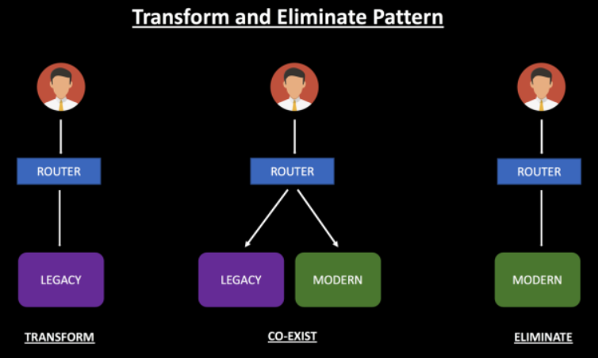

### CRN 4 -> Utilização e implementação do service discovery

* A arquitetura em microserviços reflete um estrutura organizacional, cada serviço não é apenas um projeto, é também um produto. Um grupo de desenvolvedores têm o seu produto, desde o desenvolvimento, implementação e monotorização. Dada a evolução do produto, uma forma de facilitar a compreensão do que deve ser utilizado, o service discovery é uma solução bastante pertinente.
* O service discovery foi desenvolvido com apoio do **Eureka**, este permite guardar informação sobre os serviços, todas as aplicações estão registadas no servidor, assim conhecendo as ligações a realizar. Para utilizar deve ser realizada uma conexão ao service discovery para compreender quais devem ser os pedidos.

### CRN 5 - Estudo dos métodos de decomposição em microsserviços

* Para decompor uma aplicação em monolítico numa aplicação em microsserviços, existem duas abordagens principais.
* Capacidade de negócio.
    * A capacidade de negócios é algo que uma empresa faz para gerar valor, cada funcionalidade que traga valor à empresa deve ser implementada como um serviço.
    * Principal dificuldade consiste em identificar as diferentes capacidades de negócio.
* Subdomínio.
    * Cada serviço é definido com base nos subdomínios de design.
    * Um subdomínio é uma porção menor do domínio, focada em desenvolver problemas menores.
    * Principal dificuldade consiste em identificar os diferentes subdomínios.

|   Subdomínio	                                        |  Capacidade de negócio	    |  
|:---:	                                                |:---:	                      |
|   Recomendado para arquiteturas estáveis              |   Recomendado para empresas em crescimento onde o domínio e os colaboradores é escalável.                    	|   
|   Promove serviços coesos e com baixo acoplamento	    |   A empresa não se compromete a realizar algo que não é possivel suportar.                    |   
|   Perdas de tempo na identificação de subdomínios	    |   Dependente da empresa, isto é, o crescimento dos serviços dependem do crescimento da empresa.                   |   
  
* A técnica de decomposição foi baseada na decomposição por subdomínio. Escolheu-se esta abordagem porque já existia um modelo de dominio com uma solução presente, podia-se visualizar os subdomínios poupando e facilitando o tempo de trabalho.
* Os comentários e avaliações são dependentes das sandes, podendo assim agrupar tudo no mesmo contexto, limitando-as a se encontrarem no mesmo serviço, permitindo ter menos serviços, menos manutenção e uma melhora no desempenho das equipas.
* Os outros foram separados em 2 serviços independentes devido a sua complexidade e o seu acoplamento.

### CON 4 -> Identificada a necessidade de utilizar o OpenAPI(Swagger)
* O Swagger foi desenvolvido pela **SmartBear Software** por volta de 2011.
* É capaz de ler a estrutura da API e automatizar a construção da documentação, é capaz também de criar documentação bastante agradável.
* Para implementar o swagger foi necessário adicionar duas dependências e uma anotação na main, construindo o swagger quando inicia a aplicação.
* O link é a base concatenado com __/swagger-ui.html__

### QA-1  -> Deploy das soluções para *containers*:

* Todos os serviços foram *deployed* em Docker.
* De seguida são apresentados os passos a seguir para realizar o *deploy* de cada componente ( mudar para a branch "docker"):

**UtilizadoresService | SandesService | EncomendasService**

- Navegar até ao diretório projects/backend/Microservico_{nome-do-serviço} e fazer "mvn install" seguido de "docker build -t {nome-da-imagem} ."

**Frontend**

- Navegar até ao diretório projects/frontend/gorgeous-sandwish e fazer "ng build" seguido de "docker build -t {nome-da-imagem} ."

**Service Discovery**

- Navegar até ao diretório projects/backend/SERVICE/eureka-server e fazer "mvn install" seguido de "docker build -t {nome-da-imagem} ."

**API Gateway**

- Navegar até ao diretório projects/backend/api_gateway e fazer "docker build -t {nome-da-imagem} ." seguido de "docker-compose up"

Após ser realizado o *deploy* de todos os serviços devem ser gerados os containers docker a partir das imagens e inicar os mesmos.

### Quadro Kanban final
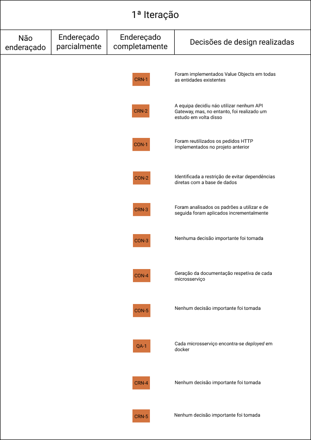

### Referências

* https://www.krakend.io/
* https://dzone.com/articles/monolith-to-microservices-using-the-strangler-patt
* https://contextmapper.org/docs/getting-started-create-project/